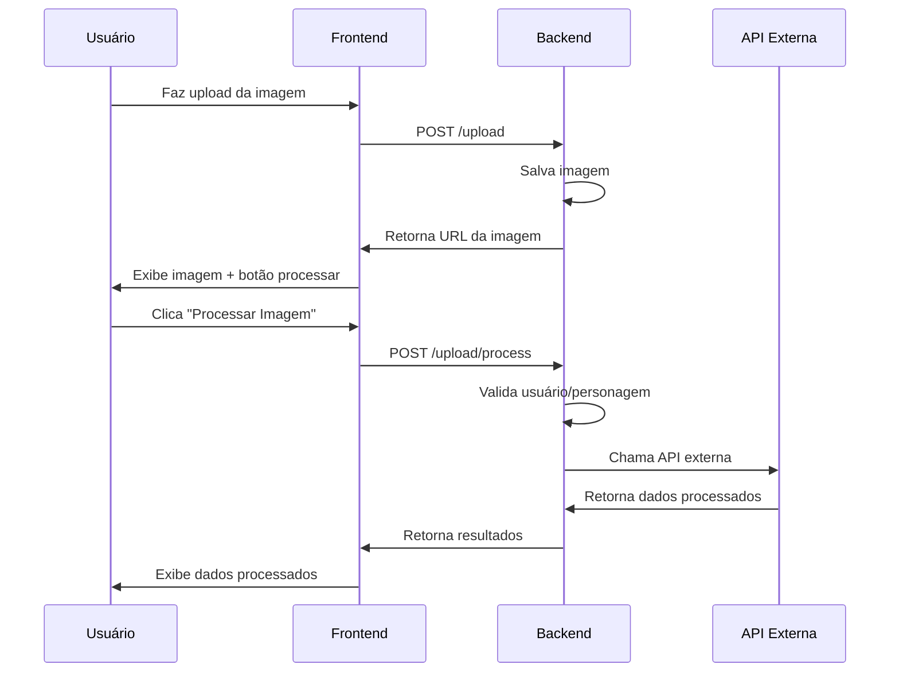

# 🔍 Processamento de Imagem do Personagem

## 📋 Visão Geral

Implementação de uma nova funcionalidade que permite processar a imagem do personagem usando uma API externa (simulada) para extrair dados e características do personagem.

## 🎯 Funcionalidades Implementadas

### Backend

#### 1. Use Case - ProcessCharacterImageUseCase
- **Arquivo**: `backend/src/modules/auth/application/use-cases/process-character-image.use-case.ts`
- **Responsabilidade**: Orquestrar o processamento da imagem do personagem
- **Validações**:
  - Verifica se o usuário possui personagem cadastrado
  - Verifica se o personagem possui imagem para processar
  - Chama API externa para processamento
  - Retorna dados processados

#### 2. Interface - IExternalApiService
- **Arquivo**: `backend/src/modules/auth/domain/services/external-api-service.interface.ts`
- **Responsabilidade**: Definir contrato para serviço de API externa
- **Métodos**:
  - `processImage(imageUrl: string): Promise<any>`

#### 3. Implementação - ExternalApiService
- **Arquivo**: `backend/src/modules/auth/infrastructure/services/external-api.service.ts`
- **Responsabilidade**: Implementar integração com API externa
- **Funcionalidades**:
  - Simulação de processamento (2 segundos de delay)
  - Retorna dados estruturados de análise
  - Logs detalhados para monitoramento

#### 4. Controller - UploadController (Novo Endpoint)
- **Arquivo**: `backend/src/modules/auth/presentation/controllers/upload.controller.ts`
- **Novo Endpoint**: `POST /upload/process`
- **Autenticação**: JWT Guard obrigatório
- **Funcionalidade**: Processa imagem do personagem do usuário autenticado

#### 5. Módulo - AuthModule
- **Arquivo**: `backend/src/modules/auth/auth.module.ts`
- **Adições**:
  - ProcessCharacterImageUseCase
  - ExternalApiService
  - EXTERNAL_API_SERVICE token

### Frontend

#### 1. Serviço - AuthApiService
- **Arquivo**: `frontend/src/modules/auth/infrastructure/services/auth-api.service.ts`
- **Novo Método**: `processCharacterImage(token: string)`
- **Funcionalidade**: Chama endpoint de processamento

#### 2. Use Case - ProcessCharacterImageUseCase
- **Arquivo**: `frontend/src/modules/auth/application/use-cases/process-character-image.use-case.ts`
- **Responsabilidade**: Orquestrar chamada de processamento no frontend
- **Interfaces**:
  - `ProcessCharacterImageRequest`
  - `ProcessCharacterImageResponse`

#### 3. Componente - CharacterUpload (Atualizado)
- **Arquivo**: `frontend/src/modules/auth/presentation/components/character-upload.tsx`
- **Novas Funcionalidades**:
  - Botão "Processar Imagem" com ícone Psychology
  - Estado de processamento (loading)
  - Exibição de dados processados
  - Interface para análise e resultados

## 🔧 Estrutura de Dados

### Dados Processados (Simulados)
```typescript
{
  imageUrl: string,
  processedAt: string,
  analysis: {
    confidence: number,
    features: string[],
    metadata: {
      width: number,
      height: number,
      format: string,
      size: string
    }
  },
  results: {
    characterType: string,
    pose: string,
    attributes: {
      strength: number,
      agility: number,
      intelligence: number,
      charisma: number
    }
  }
}
```

## 🎨 Interface do Usuário

### Botão de Processamento
- **Localização**: Após upload bem-sucedido da imagem
- **Estilo**: Botão secundário com ícone Psychology
- **Estados**:
  - Normal: "Processar Imagem"
  - Loading: "Processando..." com spinner

### Exibição de Resultados
- **Card dedicado** para dados processados
- **Seções**:
  - Informações gerais (data/hora)
  - Análise (confiança, recursos)
  - Resultados (tipo, pose, atributos)

## 🔐 Segurança

### Autenticação
- **JWT Token** obrigatório para processamento
- **Validação** de usuário autenticado
- **Verificação** de propriedade da imagem

### Validações
- **Usuário deve ter personagem** cadastrado
- **Personagem deve ter imagem** para processar
- **Tratamento de erros** robusto

## 📊 Logs e Monitoramento

### Backend
```typescript
// Logs de processamento
[ExternalApiService] Processing image: https://storage.example.com/...
[ExternalApiService] Image processed successfully: https://storage.example.com/...
```

### Frontend
- **Estados de loading** visíveis
- **Mensagens de erro** claras
- **Feedback visual** imediato

## 🚀 Como Usar

### 1. Upload de Imagem
1. Acesse `/upload` (autenticado)
2. Selecione imagem do personagem
3. Clique em "Enviar Imagem"

### 2. Processamento
1. Após upload bem-sucedido
2. Clique em "Processar Imagem"
3. Aguarde processamento (2 segundos simulados)
4. Visualize resultados

### 3. Resultados
- **Análise**: Confiança e recursos detectados
- **Tipo**: Categoria do personagem
- **Pose**: Posição/atitude detectada
- **Atributos**: Força, agilidade, inteligência, carisma

## 🔄 Fluxo Completo



## 🛠️ Próximos Passos

### Integração Real com API Externa
1. **Configurar** API externa real
2. **Implementar** autenticação da API
3. **Adicionar** retry logic
4. **Implementar** cache de resultados

### Melhorias de Interface
1. **Animações** de processamento
2. **Gráficos** para atributos
3. **Comparação** entre personagens
4. **Histórico** de processamentos

### Funcionalidades Avançadas
1. **Processamento em lote**
2. **Notificações** de conclusão
3. **Exportação** de dados
4. **Análise comparativa**

## 📝 Notas Técnicas

### Performance
- **Processamento assíncrono** simulado
- **Timeout** configurável
- **Cache** de resultados (futuro)

### Escalabilidade
- **Arquitetura** preparada para API externa
- **Injeção de dependência** para serviços
- **Logs estruturados** para monitoramento

### Manutenibilidade
- **Clean Architecture** seguida
- **Separação de responsabilidades**
- **Testes unitários** (futuro)
- **Documentação** completa

---

**Status**: ✅ Implementado e Funcionando  
**Versão**: 1.0.0  
**Última Atualização**: Novembro 2025 